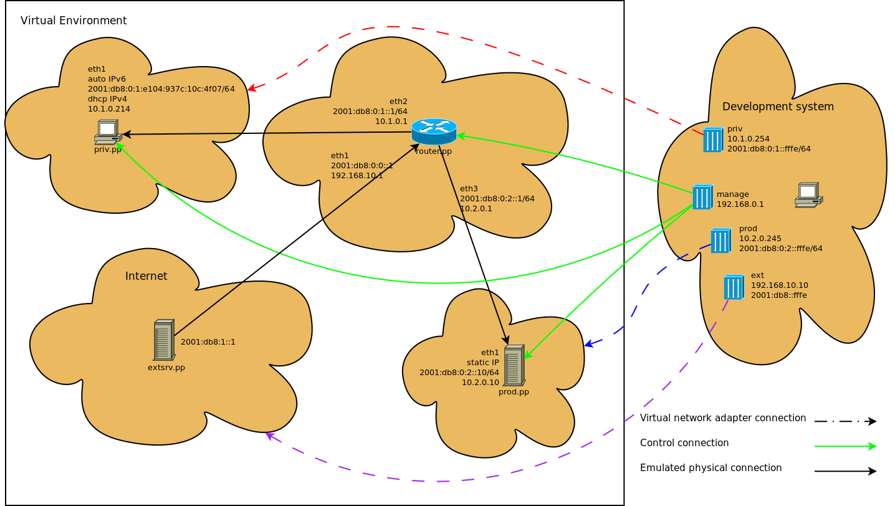

==============================================
Standard corporate linux network configuration
==============================================

This is example linux network configuration using standard corporate star type 
network topology. 

It consists of a router, a private and a production host, plus it has an internet
virtualbox, which emulates "the outside". The router acts as a central hub,
routing all connections from the internet (extsrv) to and from the other two hosts
(priv and prod). It also contains ip routing tables.

Networks and their respective configurations
--------------------------------------------

* Private network

  This network emulates a typical managed company in company with dynamically assigned
  IPs.

  .. note::

    :download:`Configuration file download <../puppet/manifests/priv.pp>`.

  ::

    ifconfig { "private":
        device => "eth1",
        family => "inet",
        changes => [
                "set method dhcp",
            ],
    }

    ifconfig { "private_inet6":
        device => "eth1",
        family => "inet6",
        changes => [
                "set method auto",
            ],
    }

  Connected to the router's 'eth2' interface

* Production network

  This network emulates a production server with static IPs

  .. note::

    :download:`Configuration file download <../puppet/manifests/prod.pp>`.

  ::

    ifconfig { "prod":
        device => "eth1",
        family => "inet",
        changes => [
                "set method static",
                "set address 10.2.0.10",
                "set netmask 255.255.255.0",
                "set network 10.2.0.0",
                "set gateway 10.2.0.1"
            ],
    }

    ifconfig { "prod_inet6":
        device => "eth1",
        family => "inet6",
        changes => [
                "set method static",
                "set address 2001:db8:0:2::10",
                "set netmask 64",
                "set gateway 2001:db8:0:2::1",
            ],
    }
  

  Connected to the router's 'eth3' interface

* The router

  This emulates a router, in this case a linux system serving as a router

  .. note::

    :download:`Configuration file download <../puppet/manifests/router.pp>`.

  ::

    include radvd

    class profile::router::network {
        ifconfig { "private":
            device => "eth2",
            family => "inet",
            changes => "
                set method static
                set address 10.1.0.1
                set netmask 255.255.0.0
                set network 10.1.0.0
            ",
        }

        dnsmasq::conf { 'dnsmasq':
            ensure  => present,
            content => 'dhcp-range=10.1.0.10,10.1.0.253,12h',
        }

        ifconfig { "private_inet6":
            device => "eth2",
            family => "inet6",
            changes => [
                    "set method static",
                    "set address 2001:db8:0:1::1",
                    "set netmask 64",
                ],
        }

        radvd::interface { 'eth2':
            options => {
                'AdvSendAdvert'     => 'on',
                'MinRtrAdvInterval' => 10,
                'MaxRtrAdvInterval' => 30,
            },
            prefixes => {
                '2001:db8:0:1::/64' => {
                'AdvOnLink'     => 'on',
                'AdvAutonomous' => 'on',
                },
            },
        }

        ifconfig { "prod":
            device => "eth3",
            family => "inet",
            changes => "
                set method static
                set address 10.2.0.1
                set netmask 255.255.0.0
                set network 10.2.0.0
            ",
        }

        ifconfig { "prod_inet6":
            device => "eth3",
            family => "inet6",
            changes => [
                    "set method static",
                    "set address 2001:db8:0:2::1",
                    "set netmask 64",
                ],
        }

